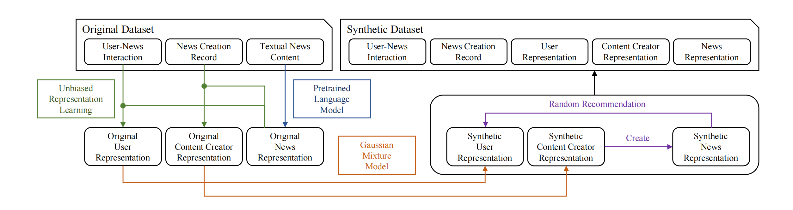
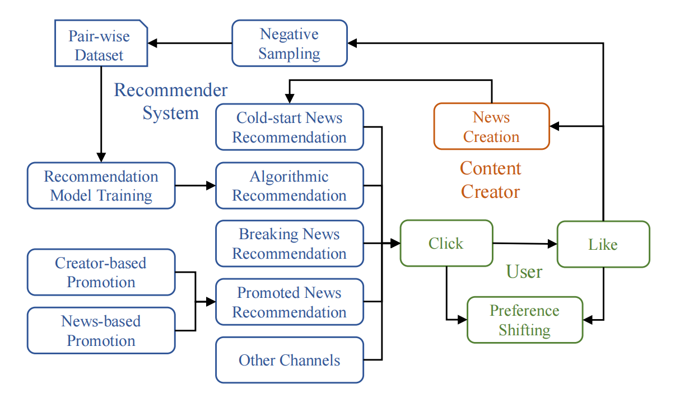
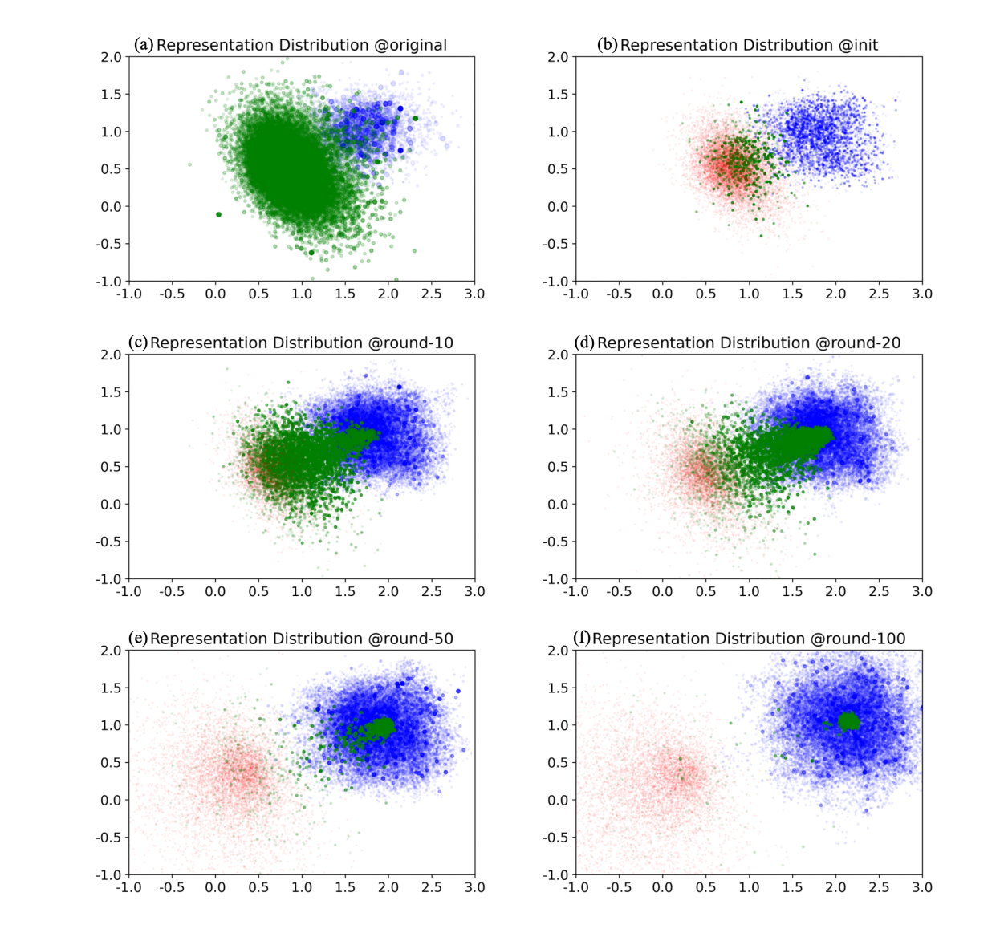

# SimuLine

Official code repo for manuscript "[Simulating News Recommendation Ecosystems for Insights and Implications](https://ieeexplore.ieee.org/abstract/document/10504866)"

## Abstract

Studying the evolution of online news communities is essential for improving the effectiveness of news recommender systems. Traditionally, this has been done through empirical research based on static data analysis. While this approach has yielded valuable insights for optimizing recommender system designs, it is limited by the lack of appropriate datasets and open platforms for controlled social experiments. This gap in the existing literature hinders a comprehensive understanding of the impact of recommender systems on the evolutionary process and its underlying mechanisms. As a result, sub-optimal system designs may be developed that could negatively affect long-term utilities. In this work, we propose SimuLine, a simulation platform to dissect the evolution of news recommendation ecosystems and present a detailed analysis of the evolutionary process and underlying mechanisms. SimuLine first constructs a latent space well reflecting the human behaviors, and then simulates the news recommendation ecosystem via agent-based modeling. Based on extensive simulation experiments and the comprehensive analysis framework consisting of quantitative metrics, visualization, and textual explanations, we analyze the characteristics of each evolutionary phase from the perspective of life-cycle theory, and propose a relationship graph illustrating the key factors and affecting mechanisms. Furthermore, we explore the impacts of recommender system designing strategies, including the utilization of cold-start news, breaking news, and promotion, on the evolutionary process, which sheds new light on the design of recommender systems.

***Data Processing Flow***



***Simulation Flow***



***Ecosystem Topic Evolution***



***The relationship graph of news recommendation ecosystem evolution***


## BibTex

@article{zhang2024simulating,
    title={Simulating News Recommendation Ecosystems for Insights and Implications},
    author={Zhang, Guangping and Li, Dongsheng and Gu, Hansu and Lu, Tun and Shang, Li and Gu, Ning},
    journal={IEEE Transactions on Computational Social Systems},
    year={2024},
    publisher={IEEE}
}

## Quick Start

### Step.1 Setup the python environments

```bash
bash setup_env.sh
```

Version of some main modules:

```bash
Ubuntu == 20.04 LTS
Python == 3.10
CUDA == 11.8
Torch == 2.0.1+cu118
DGL == 2.1.0+cu118
```

### Step.2 Setup simulation experiment configuration

Just fill your setting into "Config/Batch.xlsx".

You can set up multiple experiments in the xlsx file in one time, SimuLine would run the experiments SEQUENTLY.

```
description@str: describe this experiment
experiment@str: experiment ID, which would be used as the first tier dir name
var@str: variance ID, which would be used as the second tier dir name
run@str: run ID, which would be used as the last tier dir name
num_round@int: number of simulation round, in our experience, 50 is enough for most experiments
n_round@int: the active window of news articles
model@str: the recommendation algorithm deployed, most algos in this list are supported (under type: general recommendation)
epochs@int: number of training epoches in each simulation round
positive_inter_type@str: interaction type regard as positive interaction, such as like or click
negative_inter_type@str: optional(using "-" for None), interaction type regard as negative interaction, such as exposure
num_from_match@int: number of recommendation using similar embedding search
num_from_cold_start@int: number of recommendation using cold-start strategy
num_from_hot@int: number of recommendation using top-trending
num_from_promote@int: number of recommendation using promotion strategy
cold_start_inter_type@str: cold-start strategy ( random, like, or click )
hot_inter_type@str: name a interaction type used to compute the popularity
promote_type@str: promotion strategy( content or author )
promote_round@int: number of rounds after which reset the premoted target
init_quality_mean@float: mean value of initial news quality
init_quality_var@float: variance value of initial news quality
best_stable_quality@float: the theorical upper bound of news quality, do not modify this
init_threshold_mean@float: mean value of the user thresholds
init_threshold_var@float: variance value of the user thresholds
init_like_quality_weight_mean@float: mean value of the user preference weight on quality
init_like_quality_weight_var@float: variance value of the user preference weight on quality
init_user_concentration_mean@float: mean value of the user concentration
init_user_concentration_var@float: variance value of the user concentration
init_creator_concentration_mean@float: mean value of the author concentration
init_creator_concentration_var@float: variance value of the author concentration
uam_delta@float: step size of user interest shift
cam_delta@float: step size of author interest shift
```

### Step.3 Preprocessing

```bash
conda activate UnbiasedEmbedding
python preprocess_1.py

conda activate SimuLineDev
python preprocess_2.py
python preprocess_3.py
```

### Step.4 Launch Simulation

```bash
conda activate SimuLineDev
python main.py
```

